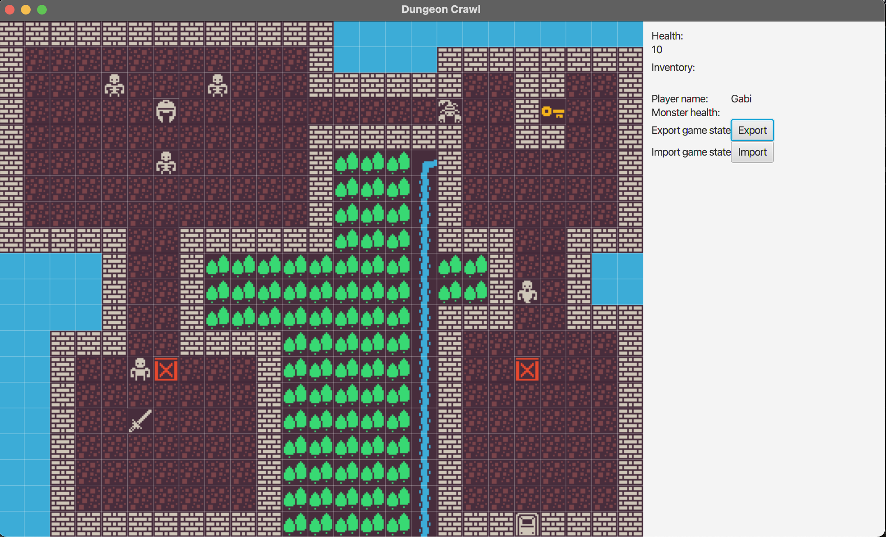

Dungeon Crawl is a RogueLike minigame that I created using Java and JavaFx for graphics.
I developed complex algorithms to make everything functional, wrote jUnit tests, created the graphics, combat system, notifications, inventory, self moving actors (Ghost, Skull) traps, weapons, dinamic map that moves with the player and more.
This project was part of my learning course in Java, I always liked video games so I gave it a try.
This is not a finished product but it is playable.

